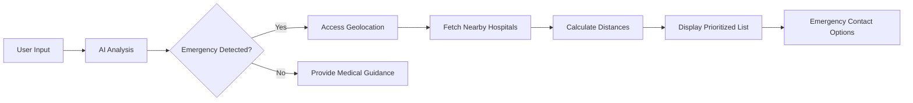
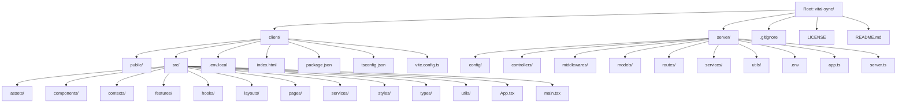

<div align="center">
  
</div>

# VitalSync - AI-Powered Healthcare Platform

[](https://opensource.org/licenses/MIT)


VitalSync is an AI-powered healthcare platform that provides intelligent symptom analysis, emergency response guidance, and comprehensive disease information. Built for a hackathon demonstration, this solution bridges the gap between initial symptom assessment and professional medical care.

## 📽️ Live Demo
[Access the live demo here](https://youtu.be/EEmNplJKwCc?si=z0MRB8aU7kFLt72m) *(Note: Hackathon demo link would go here)*

## 🚀 Introduction  

### The Problem  
In today's healthcare landscape, patients face critical challenges: information overload when researching symptoms, delayed emergency response during critical situations, and difficulty finding nearby medical facilities during crises. These gaps in the healthcare journey can lead to delayed treatment and worsened outcomes.  

### Our Solution  
**VitalSync** bridges the gap between symptom awareness and professional medical care through an AI-powered platform that:  
1. Provides instant symptom analysis using cutting-edge AI  
2. Detects emergencies and locates nearby hospitals in real-time  
3. Offers a comprehensive, risk-categorized medical encyclopedia  
4. Maintains strict security standards for sensitive health data  

## 🛠️ Tech Stack  

| Technology        | Purpose                          | Why We Chose It                          |
|-------------------|----------------------------------|------------------------------------------|
| **React + Vite**  | Frontend framework               | Lightning-fast development and HMR       |
| **TypeScript**    | Static typing                    | Enhanced code safety and maintainability |
| **Node/Express**  | Backend server                   | Efficient API development                |
| **MongoDB**       | Database                         | Flexible schema for healthcare data      |
| **Passport.js**   | Authentication middleware        | Robust session management                |
| **Bcrypt.js**     | Password hashing                 | Military-grade security for user data    |
| **OpenRouter**    | AI gateway (GPT-4o)              | Access to cutting-edge medical AI        |
| **Overpass API**  | Geolocation services             | Open-source, reliable location data      |

## 🧩 Key Features  

### 🧠 AI Symptom Checker  
- **Natural Language Processing**: Understands symptom descriptions in plain English  
- **Emergency Detection**: Instantly flags critical symptoms (chest pain, breathing issues)  
- **Context-Aware Responses**: Maintains conversation history for accurate diagnosis  
- **Geolocation Integration**: Automatically fetches nearby hospitals during emergencies  

### 📚 Disease Encyclopedia  
- **Risk-Based Organization**: Diseases categorized by severity (mild/moderate/high)  
- **Comprehensive Information**: Symptoms, causes, treatments, and prevention  
- **Instant Search**: Quick access to critical medical knowledge  

### 🔐 Secure Authentication  
- **Session-Based Auth**: Secure cookie management with HttpOnly flags  
- **Password Hashing**: Bcrypt with salt rounds for maximum security  
- **Protected Routes**: Role-based access control to sensitive data  

### 📱 Adaptive Device Handling  
- **Mobile Optimization**: Automatic GPS access for precise location  
- **Desktop Experience**: Manual location input with typeahead search  
- **Responsive UI**: Seamless experience across all device sizes  
- **Light/Dark Themes**: Reduced eye strain during extended use  

## 🧠 How It Works  

### Core System Flow  


### AI Integration (OpenRouter + GPT-4o)  
```typescript
// Medical analysis service
export const getMedicalResponse = async (query: string, history: Message[]) => {
  const messages = [
    {
      role: "system",
      content: "You are a medical assistant. Analyze symptoms, identify potential emergencies..."
    },
    ...history,
    { role: "user", content: query }
  ];

  const response = await fetch("https://openrouter.ai/api/v1/chat/completions", {
    method: "POST",
    headers: {
      Authorization: `Bearer ${OPENROUTER_KEY}`,
      "Content-Type": "application/json"
    },
    body: JSON.stringify({
      model: "openai/gpt-4o",
      messages,
      temperature: 0.3,
      max_tokens: 500
    })
  });

  return response.json();
};
```

### Hospital Location System  
```javascript
// Hospital prioritization service
export const prioritizeHospitals = (hospitals, userLat, userLon) => {
  return hospitals.map(hospital => {
    const distance = calculateDistance(
      userLat, 
      userLon,
      hospital.lat, 
      hospital.lon
    );
    return { ...hospital, distance };
  }).sort((a, b) => a.distance - b.distance);
};

// Haversine formula implementation
const calculateDistance = (lat1, lon1, lat2, lon2) => {
  const R = 6371; // Earth's radius in km
  const dLat = deg2rad(lat2 - lat1);
  const dLon = deg2rad(lon2 - lon1);
  const a = 
    Math.sin(dLat/2) * Math.sin(dLat/2) +
    Math.cos(deg2rad(lat1)) * Math.cos(deg2rad(lat2)) * 
    Math.sin(dLon/2) * Math.sin(dLon/2);
  const c = 2 * Math.atan2(Math.sqrt(a), Math.sqrt(1-a)); 
  return R * c; // Distance in km
};
```

## 📂 Project Architecture  



## 🔐 Authentication & Security  

### Security Implementation  
1. **Password Protection**:  
   ```javascript
   // Password hashing with bcrypt
   const saltRounds = 12;
   const hashedPassword = await bcrypt.hash(password, saltRounds);
   ```
   
2. **Session Management**:  
   ```javascript
   // Passport.js session configuration
   app.use(session({
     secret: process.env.SESSION_SECRET,
     resave: false,
     saveUninitialized: false,
     cookie: { secure: true, httpOnly: true, maxAge: 24*60*60*1000 }
   }));
   ```

3. **Protected Routes**:  
   ```typescript
   // Authentication middleware
   export const requireAuth = (req: Request, res: Response, next: NextFunction) => {
     if (req.isAuthenticated()) return next();
     res.status(401).json({ error: "Unauthorized access" });
   };
   ```

## 🚀 Getting Started  

### Prerequisites  
- Node.js ≥18.x  
- MongoDB Atlas account  
- OpenRouter API key ([Get free access](https://openrouter.ai))  

### Installation  
```bash
# Clone repository
git clone https://github.com/your-username/vital-sync.git
cd vital-sync

# Install backend dependencies
cd server && npm install

# Configure environment variables
echo "MONGODB_URI=your_connection_string" >> .env
echo "OPENROUTER_API_KEY=your_api_key" >> .env
echo "SESSION_SECRET=your_secret" >> .env

# Start backend server
npm run dev

# Install frontend dependencies
cd ../client && npm install

# Configure frontend environment
echo "VITE_API_BASE_URL=http://localhost:5000" >> .env.local

# Launch development server
npm run dev
```

## 📸 UI Preview  
*(Actual project would include screenshots here)*  

| Feature | Light Mode | Dark Mode |
|---------|------------|-----------|
| **Symptom Analysis** |  |  |
| **Emergency Response** |  |  |
| **Disease Library** |  |  |

## 📜 License  
Distributed under the MIT License. See `LICENSE` for more information.

## 🙏 Acknowledgements  
- **OpenRouter** for providing access to state-of-the-art language models  
- **Overpass API** for reliable open-source geolocation services  
- **MongoDB Atlas** for cloud database infrastructure  
- **React Community** for comprehensive documentation and resources  

---

**VitalSync** was created during the 2023 HealthTech Hackathon by Team NEXUS. For inquiries contact: dev@vitalsync.health

